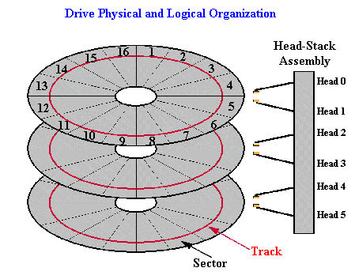

# Notes

## Assembly related (NASM)
-   I can set a register to zero by doing something like: 
    `xor ax, ax` where `ax` is the register.

## OS System

### Real mode
-   In x86 assembly, the `ah` register is used to specify functions when calling interrupts. 
    For instance, with the    `0x10` interrupt, setting `ah` to `0x0e` will print a character. 
    For the `0x13` interrupt, setting `ah` to `0x00` will reset the floppy, 
    and setting `ah` to `0x02` will read sectors.

### Hardware
-   Floppy disks have 2880 sectors, and here comes math!
    if you look here: 

    

    You can see that there are 16 tracks (16 tracks = 1 cylinder),
    each track having 18 sectors, each "platter" having two
    sides, and each platter having 2 heads. So if we do the math:

    `sectors count = number of tracks * number of sectors per track * number of sides per platter * total number of heads`

    Which translates to:

    `2880 = 16 * 18 * 2 * 6` wait a minute... math isn't mathing...
    I was wrong.